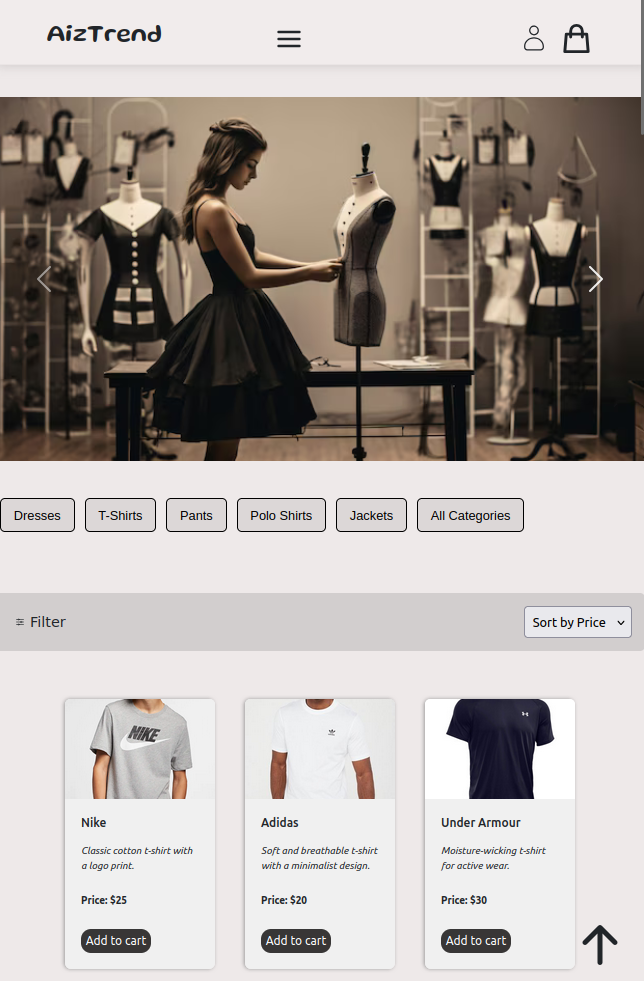
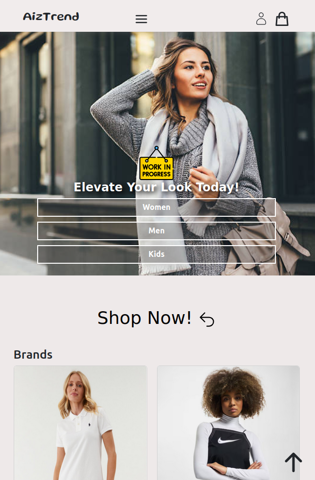

## E-Commerce Website (Ongoing Project)

This is a work-in-progress e-commerce web application where users can browse products, filter items by categories and gender, add products to the cart, and manage their shopping experience. The project is currently under development and will continue to evolve with new features and improvements.

  
Table of Contents

  <ol>
    <li><a href="#about-the-project">Features</a></li>
    <li><a href="#screenshot">Screenshot</a></li>
    <li><a href="#usage">Usage</a></li>
    <li><a href="#planned features">Planned Features</a></li>
    <li><a href="#contact">Contact</a></li>
  </ol>

### Features

- Browse products by categories like Women, Men, and Kids.
- Filter products by gender and category.
- Sorting by price.
- Add products to cart and manage item quantities.
- Real-time cart updates with total price and quantity.
- Persistent cart using localStorage.
**Ongoing:** Improving responsiveness, product filtering, and sorting features.

### Screenshot

Here are some screenshots of the current progress of the e-commerce website:

  
  

(<a href="#e-commerce-website-ongoing-project">back to top</a>)

### Usage

#### Product Page 

- Users can browse a collection of products, with the ability to filter by category and gender.
- Product details include name, price, description, and image.

#### Cart

- Users can add, remove, and adjust product quantities in their shopping cart.
- Cart totals are dynamically updated based on changes.

#### Planned Features

This project is still under active development. Here are some of the planned features and improvements:

- **Sorting:** Adding functionality to sort products by price, popularity, etc.
- **Search:** Implementing a product search feature.
- **User Authentication:** Adding user accounts, login, and signup.
- **Order History:** Implementing a feature where users can view their past purchases.
- **Improved UI/UX:** Enhancing the user interface and making it more responsive.
- **Checkout:** Building a full checkout experience with payment integration.
- **API Development:** Creating RESTful APIs for product management, user authentication, and order processing.
- **Database Integration:** Setting up a database to store user and product information.
- **User Accounts:** Managing user profiles and authentication.

## Contact

If you have any questions or suggestions, feel free to reach out!

- **Name**: Aiza
- **LinkedIn**: https://www.linkedin.com/in/aiza-s-400319313

(<a href="#e-commerce-website-ongoing-project">back to top</a>)

